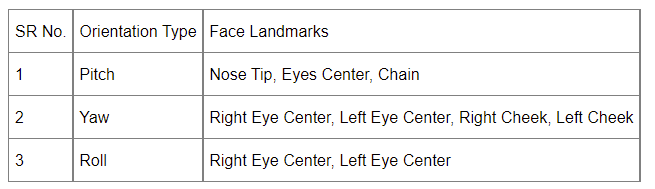

<div>
<h1>Real-Time Face Orientation Estimation: Yaw, Pitch and Roll </h1>
<br>

<div align="center">
  </a>
</div>

This repository focuses on real-time estimation of face orientation in terms of rotation in 3 different dimensions referred as Yaw, Pitch and Roll. In most of the scenarios, there's a requirement of frontal up-right faces e.g. gender expression and recognition where presice roll estimation is needed for better classification. A clear view of the three different types of orientation is given in Fig 1 for better understanding.

<br>
<div align="center">
  </a>
  <br>
  Fig 1: Three different types of orientations along x-axis, y-axis and z-axis
</div>

<br>

</div>

Our algorithm works on the top of MediaPipe Face Mesh solution that has been used as the base layer for the estimation of face geomatery of 468 landmarks. It utilizes some specific landmarks for estimating orientation for each dimension given in the Table 1. Our solution estimates Pitch index and Yaw index giving values between 0 and 1 and roll angle giving a value between 0 and 180 degrees. The estimated values are then compared to certain thresholds (specified by the user) to inform the user of its face orientation e.g. if user is looking towards too down or up.

<br>
<div align="center">
  </a>
  <br>
  Fig 1: Three different types of orientations along x-axis, y-axis and z-axis
</div>
  
<br>

## <div>General Capabilities</div>

This repository implements most of the features which are required for complete road traffic monitoring system, here are the additional capabilities of it:

* <b>Face Orientation Estimation:</b> Estimates the face orientation in three different dimensions in terms of yaw, pitch and roll.

* <b>Image Capturing:</b> The user can capture an image by pressing 'c' key or keyboard space key. The image is saved in the exp directory by default. The app first checks if all thresholds are satisfied for yaw, pitch and roll, only then the photo is captured.

* <b>Visualization:</b> A good visualization has been added to the solution to track the orientation estimations in a better way and align the face accordingly.

<br>

## <div>Quick Start Examples</div>

<details open>
<summary><h3><b>Install</b></h3></summary>

[**Python 3.7.0**](https://www.python.org/) or greater and other libraries are required listed in the requirements.txt including
[**mediapipe**](https://google.github.io/mediapipe/). You must install Python before you proceed further.

<!-- ```bash
# clone the repository 
$ git clone https://github.com/NaumanHSA/Real-Time-Traffic-Monitoring-System-using-YOLOv5.git

$ cd yolov5
$ pip install -r requirements.txt
``` -->

```bash
# step 1: 
# download and extract the zip file containing the code 

# step 2: 
# direct into the root direcotry of the project
$ cd code

# step 3:
# Run the following command to install the required packages
$ pip install -r requirements.txt
```

</details>

<details open>
<summary><h3><b>Inference</b></h3></summary>

Inference can be performed directly by running the inference.py script. But before we have to make sure the configurations are set in the CONFIG.py file, e.g. SOURCE is the path to any video or set it to 0 for webcam inference.

```bash
    python inference.py
```

</details>

<details open>
<summary><h3><b>Configuration File</b></h3></summary>
The project configuration has been all defined in the CONFIG.py script. Following is the breif explaination for every parameter:

<br>
<h3>General Configurations</h3>

* <b>SOURCE: </b>Path to input video or set it to 0 for webcam, default is 0.

* <b>OUTPUT_IMAGES_PATH: </b>Output path where images will be saved, default is /exp/.

* <b>IMAGE_SIZE: </b>Size of output video to display, default is (1080, 720).

* <b>VIS: </b>Visualize detections during inference, default is True.

* <b>PITCH_THRESHOLD: </b>the value of pitch index between [-PITCH_THRESHOLD, +PITCH_THRESHOLD] will be considered for as valid value. The value of PITCH_THRESHOLD will always be between [0,1] inclusive, default is 0.2.

* <b>YAW_THRESHOLD: </b>the value of yaw index between [-YAW_THRESHOLD, +YAW_THRESHOLD] will be considered for as valid value. The value of YAW_THRESHOLD will always be between [0,1] inclusive, default is 0.2.

* <b>ROLL_THRESHOLD: </b>the value of roll angle between [-ROLL_THRESHOLD, +ROLL_THRESHOLD] will be considered for as valid angle. The value of ROLL_THRESHOLD will always be between [0,1] inclusive, default is 20 degrees.

</details>

## <div>Author</div>

Muhammad Nouman Ahsan

## <div>References</div>

* Mediapipe https://google.github.io/mediapipe/
* Mediapipe Github https://github.com/google/mediapipe
* In-plane face orientation estimation in still images https://hal.archives-ouvertes.fr/hal-01169835/
